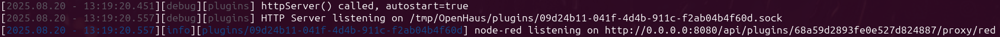
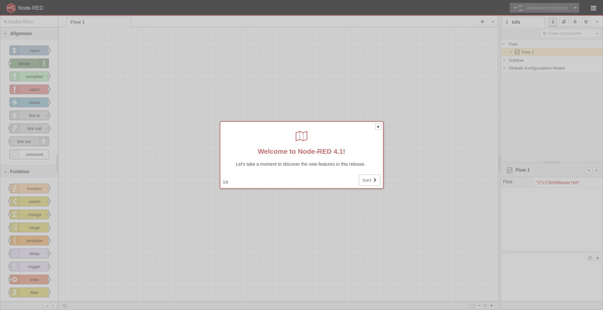
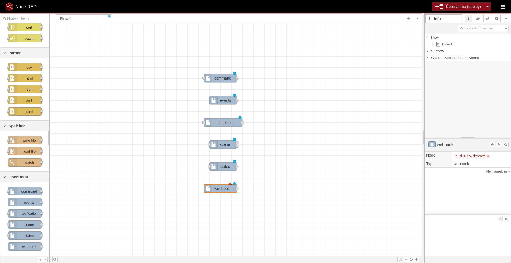
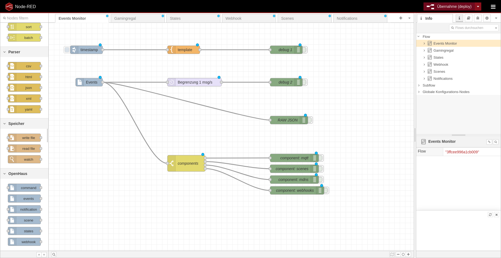
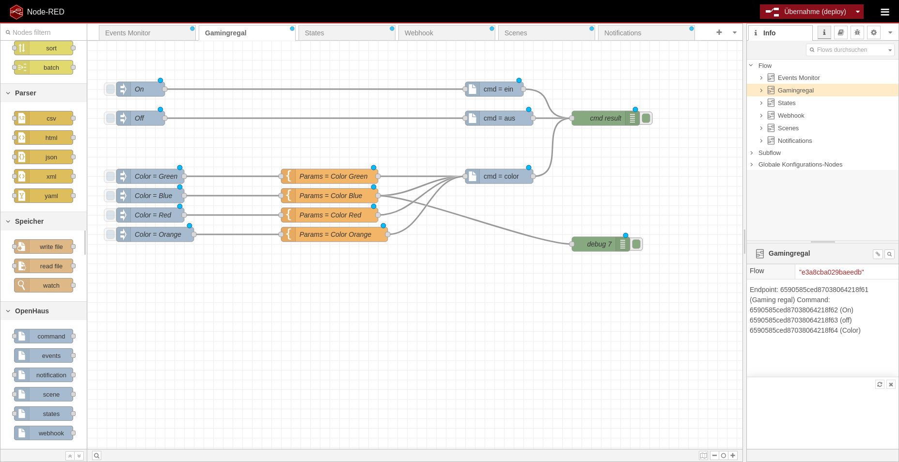
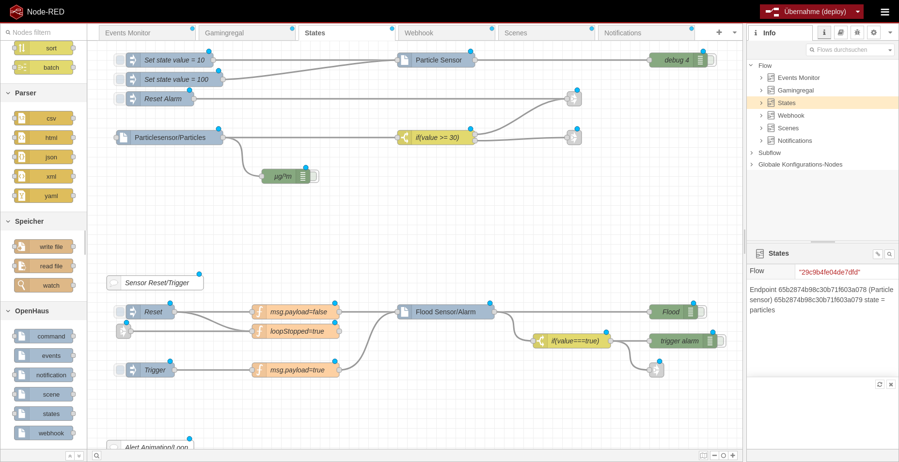
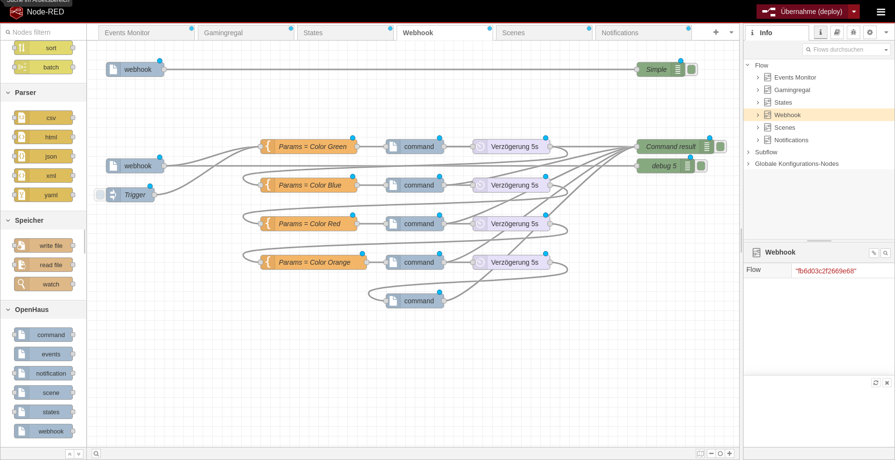
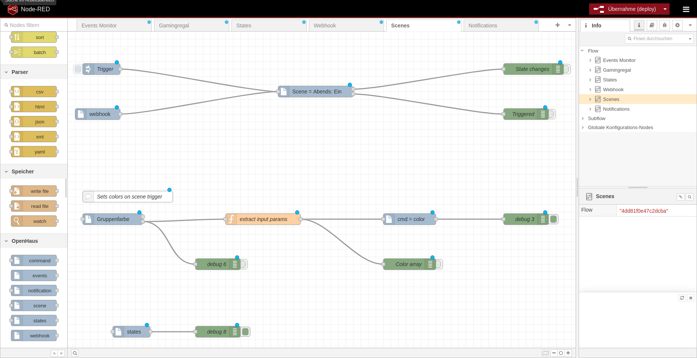
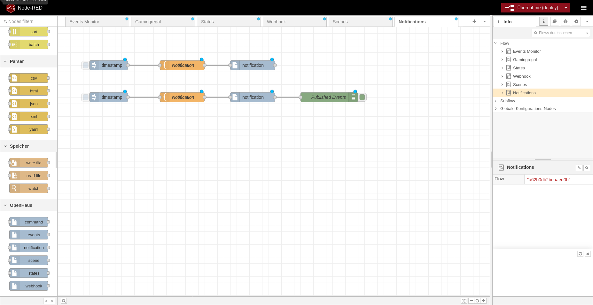

# Introduction
This plugin installs & provides a embedded NODE-RED instance.<br />
The Admin UI is available at http://\<host\>:\<port\>/api/plugins/\<_id\>/proxy/red <br />
E.g. http://192.168.2.3:80/api/plugins/68a59e9d83cf968a8438f90c/proxy/red

>[!NOTE]
> The real path/url depends on your plugin item object id<br />
> **Not** to confuse with the plugin uuid (09d24b11-041f-4d4b-911c-f2ab04b4f60d)
> 
> To make the access easier, there will be a in future versions a direct link in the OpenHaus Administration UI<br />
> Such link is printed into the log/console/stdout
> 

# Screenshots
|                             |                             |                             |
| --------------------------- | --------------------------- | --------------------------- |
|  |  |  |
|  |  |  |
|  |  |                             |


# Installation
1) Create a new plugin over the OpenHaus backend HTTP API
2) Mount the plugin source code folder into the backend
3) run `npm install`

# Development
Add plugin item via HTTP API:<br />
[PUT] `http://{{HOST}}:{{PORT}}/api/plugins/`
```json
{
   "name":"NODE-RED",
   "version": "0.1.0",
   "intents":[
      "store",
      "vault"
   ],
   "uuid": "09d24b11-041f-4d4b-911c-f2ab04b4f60d"
}
```

Mount the source code into the backend plugins folder
```sh
sudo mount --bind ~/projects/OpenHaus/plugins/oh-plg-node-red/ ~/projects/OpenHaus/backend/plugins/09d24b11-041f-4d4b-911c-f2ab04b4f60d/
```